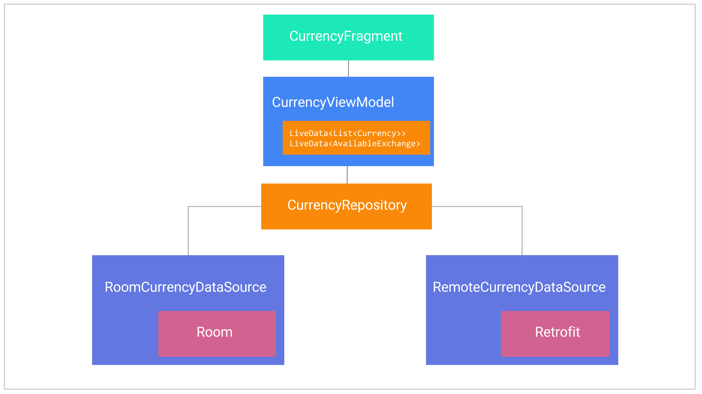
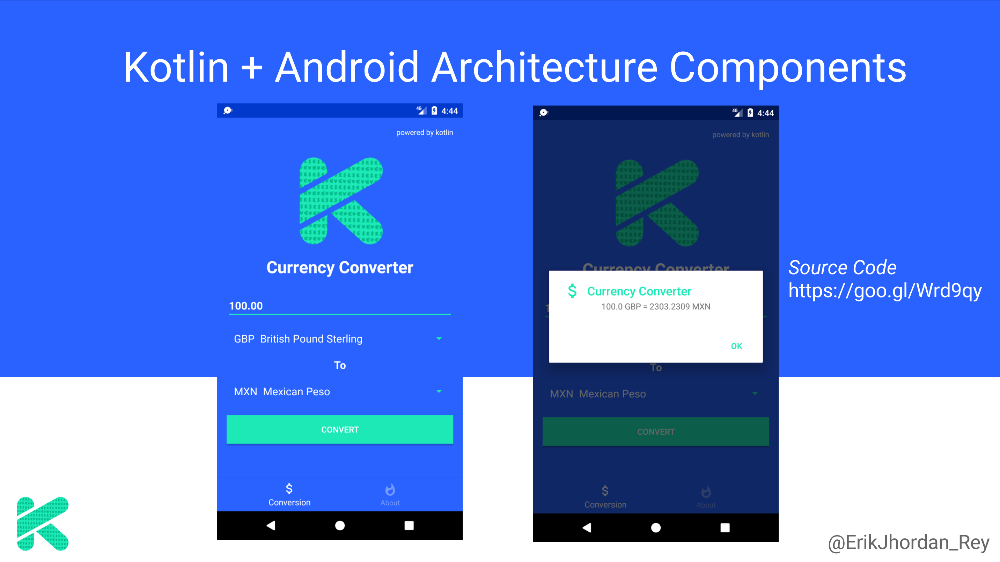

 # Android-Architecture-Components-Kotlin
 
 

Android Sample **Kotlin Devises (currency converter)** used to practice Kotlin and Android Architecture Components.

### Support of Kotlin & Architecture Components

I wrote a post in my blog called [Support of Kotlin & Architecture Components](https://erikcaffrey.github.io/ANDROID-kotlin-arch-components/) to explain how **Android Architecture Components** works.

# Kotlin Devises architecture

Tools used on the sample project
------------------------------------
* [Kotlin][6]
* [Android Architecture Components][1]
* [RxJava & RxAndroid][2]
* [Dagger 2][3]
* [Retrofit][4]
* [OkHttp][5]
* [Currency Layer API to retrieve currency exchanges (free version)][7]

[1]: https://developer.android.com/topic/libraries/architecture/adding-components.html
[2]: https://github.com/ReactiveX/RxAndroid
[3]: https://github.com/google/dagger
[4]: https://github.com/square/retrofit
[5]: https://github.com/square/okhttp
[6]: https://kotlinlang.org/
[7]: https://currencylayer.com/

# Demo

### Resources to start with Kotlin on Android

* [Getting started with Android and Kotlin by Jetbrains][9]
* [Get Started with Kotlin on Android by Google][10]
* [Kotlin Lang Reference][11]
* [Kotlin Blog by Jetbrains][12]
* [Kotlin Kapt Annotation processing][13]
* [Kotlin for Android Developers by Antonio Leiva][13]

 [9]: https://kotlinlang.org/docs/tutorials/kotlin-android.html
[10]: https://developer.android.com/kotlin/get-started.html
[11]: https://kotlinlang.org/docs/reference/
[12]: https://blog.jetbrains.com/kotlin/
[13]: https://kotlinlang.org/docs/reference/kapt.html
[14]: https://antonioleiva.com/kotlin-android-developers-book/

### Resources to start with Android Architecture Components 

* [Android Architecture Components][20]
* [Adding Components to your Project][21]
* [Android Architecture Components Samples][22]
* [Android Architecture Components CodeLabs][23]
* [Android Conferences - Google I/O 2017][24]

[20]: https://developer.android.com/topic/libraries/architecture/index.html
[21]: https://developer.android.com/topic/libraries/architecture/adding-components.html
[22]: https://github.com/googlesamples/android-architecture-components
[23]: https://codelabs.developers.google.com/?cat=Android
[24]: https://www.youtube.com/results?search_query=google+I%2FO+android+components

# Bonus 
#### LiveData-DataBinding-Kotlin

" You can now use a LiveData object as an observable field in data binding expressions. The ViewDataBinding class now includes a new setLifecycle method that you need to use to use to observe LiveData objects "

[Source Code](https://github.com/erikcaffrey/LiveData-DataBinding-Kotlin)

Do you want to contribute?
--------------------------

Feel free to report or add any useful feature, I will be glad to improve it with your help.

Developed By
------------

* Erik Jhordan Rey  - <erikjhordan.rey@gmail.com> or <erik.gonzalez@schibsted.com>

License
-------

    Copyright 2017 Erik Jhordan Rey

    Licensed under the Apache License, Version 2.0 (the "License");
    you may not use this file except in compliance with the License.
    You may obtain a copy of the License at

       http://www.apache.org/licenses/LICENSE-2.0

    Unless required by applicable law or agreed to in writing, software
    distributed under the License is distributed on an "AS IS" BASIS,
    WITHOUT WARRANTIES OR CONDITIONS OF ANY KIND, either express or implied.
    See the License for the specific language governing permissions and
    limitations under the License.

